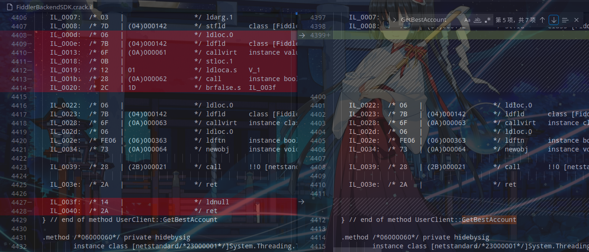

# 前言

软件都知道，不做解释；

笔者使用的是 Linux 操作系统，因而 dnspy, reflexil 等工具无法使用（也可能我没找到相关可视化工具），

故采用 AvaloniaILSpy + ilasm / ildasm 进行处理；

classic 版本也不支持 Linux，故有此修改。

# 预处理

准备好 `ildasm` 与 `ilasm`

使用 `ildasm` 将 `Fiddler.WebUi.dll` 转换为 il 文件

使用 `ildasm` 将 `FiddlerBackendSDK.dll` 转换为 il 文件

## Linux 获取 ilasm (ildasm)

1. 安装好 dotnet，打开一个空文件夹并执行后续命令
2. dotnet new console -n test
3. cd test
4. dotnet add package Microsoft.NETCore.ILAsm (ILDAsm)
5. dotnet publish -c Release --self-contained --runtime linux-x64
6. export PATH=$(pwd)/bin/Release/netcoreapp3.1/linux-x64/publish:$PATH
7. ilasm (ildasm)

# 处理

## main.xxxx.js

> 为何在此进行修改？
> 
> 这是使用控制台进行调试操作探索出来的。


打开 `fiddler/resources/app/out/WebServer/ClientApp/dist/main.xxx.js` 搜索 `updateUserLicense` 

函数开始处添加：（请将 `Ie` 替换为参数名称）

```javascript
Ie.licenseInfo.currentLicense = "Pro"
Ie.licenseInfo.hasExpiredTrial = false
Ie.licenseInfo.isTrialAvailable = false
Ie.licenseInfo.hasValidLicense = true
```


## Fiddler.WebUi.il

> 如何知道修改此文件？
> 
> 当修改 `main.js` 尝试调出控制台时，程序是不能启动的，通过程序提示找到关键代码

> 修改此文件去除文件校验，
> 
> 在 3.3.0 版本开始 `main.xxx.js` 也被加入校验流程，在此之前此dll文件的修改是可选的。
> 
> 去除 `TryOpenElectronMainScript` 的校验之后，可以修改 `app/out/main.js` 调出控制台

对两个函数 `TryOpenClientMainScript` 与 `TryOpenElectronMainScript` 做相同操作：

将函数体内容修改为 直接返回 `true`

删除函数内以下代码之前的所有代码（以下代码含义为 `return true;`）

```
IL_0208:  /* 17   |                  */ ldc.i4.1
IL_0209:  /* 2A   |                  */ ret
```


删除后大概这个效果：


## FiddlerBackendSDK.il

> 如何知道修改此文件？
> 
> 这是通过替换验证服务器抓到的数据，操作有点麻烦；
> 
> 不过，如果对验证服务器做较为详尽的复现，应该能实现离线化。


### method FiddlerBackendSDK.User.UserClient::GetBestAccount

搜索 `UserClient::GetBestAccount`

删除 IL_000d - IL_0020 对应 if 语句

删除 IL_003f - IL_0040 对应 `return null;` 语句



### method '<>c__DisplayClass18_0'::'<GetBestAccount>b__0'

搜索 `<GetBestAccount>b__0`

删除 IL_0000 - IL_0019 , 在 IL_001e 前插入 `ldc.i4.1`  (即函数体直接返回 `true` )

