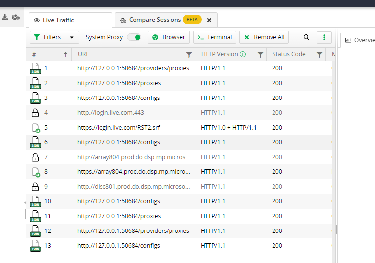

## Patch

1. 下载Electron https://github.com/electron/electron/releases , 解压到`Electron`文件夹
2. 复制 `Fiddler Everywhere/resources` -> `Electron/resources`
3. 复制 `v4.6.1/Fiddler.WebUi/Fiddler.WebUi.dll` -> `Electron/resources/app/out/WebServer`
4. 复制 `v4.6.1/FiddlerBackendSDK/FiddlerBackendSDK.dll` -> `Electron/resources/app/out/WebServer`
5. 复制 `v4.6.1/server/file` -> `Electron/resources/app/out/file`

## 修改 main.js

1. 打开 `resources/app/out/main.js`
2. `v4.6.1/server/index.js` 的内容添加到 `resources/app/out/main.js` 开头

## 修改 main.xxx.js

1. 打开 `resources/app/out/WebServer/ClientApp/dist/main.xxx.js`
2. 替换所有 `https://api.getfiddler.com` 为 `http://127.0.0.1:5678/api.getfiddler.com`
3. 搜索并删除 `.then(c=>t.verifyResponse(c?.headers,c?.body))`

## Picture

