## 1 确定文件位置

1. 搜索 `offline`

  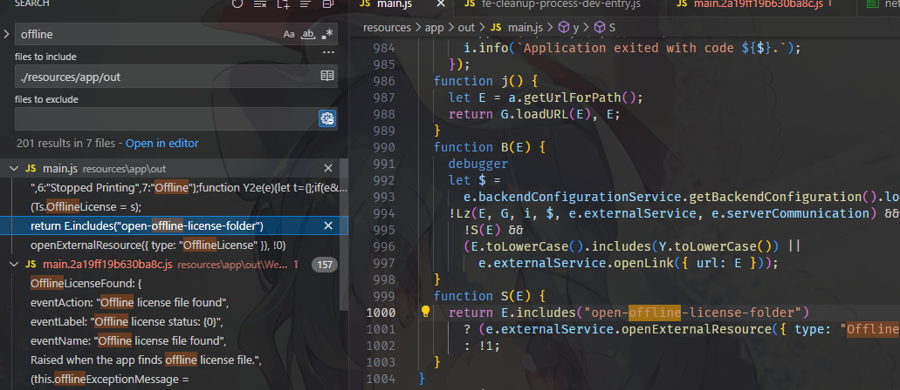
2. 在控制台输入 `window.open('open-offline-license-folder')`，提示文件夹不存在，根据命令判断最后的License应该是文件夹而不是文件

  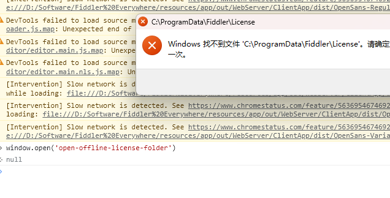
3. 按照这个结构建立文件夹
4. 搜索 `License`, 发现一个文件名 `license.lic`

  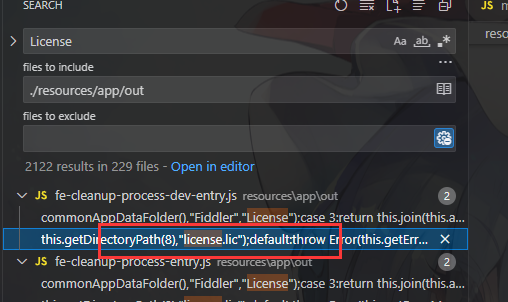
5. 在License文件夹下面新建空白文件 `license.lic`
6. F5刷新，发现文件被重命名了，说明文件没错；而且界面提示许可证无效。

  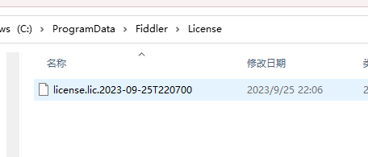
  

## 2 确定检测代码位置

1. 一般来说，程序修改文件遇到阻挠时会报错；
    所以，我们把 licnese.lic 的权限给删掉，让它检测到文件，但是重命名不了。
    
    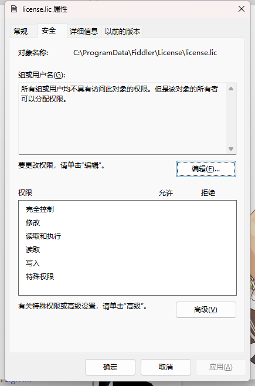
2. F5刷新，查看日志：
    ```
    [Error] [NETCore] System.UnauthorizedAccessException: Access to the path 'C:\ProgramData\Fiddler\License\license.lic' is denied.
   at Microsoft.Win32.SafeHandles.SafeFileHandle.CreateFile(String fullPath, FileMode mode, FileAccess access, FileShare share, FileOptions options)
   at Microsoft.Win32.SafeHandles.SafeFileHandle.Open(String fullPath, FileMode mode, FileAccess access, FileShare share, FileOptions options, Int64 preallocationSize, Nullable`1 unixCreateMode)
   at System.IO.Strategies.OSFileStreamStrategy..ctor(String path, FileMode mode, FileAccess access, FileShare share, FileOptions options, Int64 preallocationSize, Nullable`1 unixCreateMode)
   at Fiddler.WebUi.Services.Backend.BackendService.GetOfflineLicense()
    ```
    得出代码在 `Fiddler.WebUi.Services.Backend.BackendService.GetOfflineLicense` 里面。

## 3 分析检测逻辑

1. DEBUG跟踪进入了一个验证方法 `service.ValidateOfflineLicense`，又进入一个解密方法 `TryDecryptLicense`

    以下是 `TryDecryptLicense` 的简化代码：

    ```C#
    var span2 = encryptedLicense.AsSpan<byte>();
    // Slice(start, length)
    span4 = span2.Slice(0, 8); // salt
    span = span2.Slice(8, 16); // iv
    span3 = span2.Slice(24, span2.Length - 8 - 16);
    // OfflineLicenseFileDTO.Iterations 0x000003E8
    // OfflineLicenseFileDTO.Hash SHA256
    Rfc2898DeriveBytes rfc2898DeriveBytes = new Rfc2898DeriveBytes(key, span4.ToArray(), OfflineLicenseFileDTO.Iterations, OfflineLicenseFileDTO.Hash);
    Aes aes = Aes.Create();
    aes.IV = span.ToArray();
    aes.Key = rfc2898DeriveBytes.GetBytes(32);
    aes.Padding = PaddingMode.PKCS7;
    cryptoTransform = aes.CreateDecryptor();
    decrypted = cryptoTransform.TransformFinalBlock(span3.ToArray(), 0, span3.Length);
    ```
    | 0 -> 8 | 8 -> 24 | 24 -> end |
    |--------|---------|-----------|
    | span4  | span    | span3     |
    | salt   | iv      | data      |
    
    应该是解密成功就给flag赋值true

    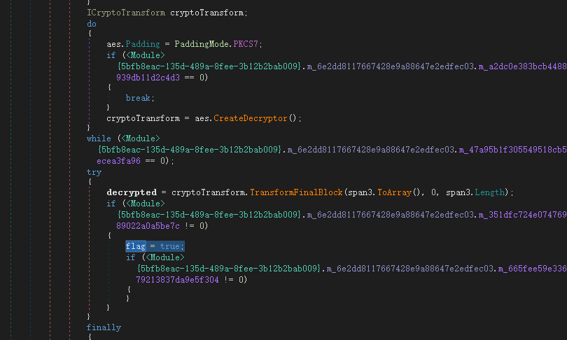

2. 根据上面代码得出是AES解密，而AES是用同样的“密钥”来加解密数据的，所以这个我们可以进行复现加密逻辑。
    
    搜索资料可知AES加解密需要的数据：KEY和IV；IV在license里面，而 `AES的KEY` 是由 `内置的key` 和 `license里面的salt` 得到的。这个 `内置的KEY` 可以通过下断点查看变量数据取得。

    以下是一些代码：
    ```C#
    // 由 `内置的key(password)` 生成 `AES的KEY`
    // `内置的key` 就是password。Rfc2898DeriveBytes文档注释第一个参数名就是password，所以就用了password这个名称
    public static byte[] GenerateKeyFromPassword(byte[] password, byte[] salt) {
        const int iterations = 0x03E8; // 0x03E8
        const int keySize = 32;

        using (var deriveBytes = new Rfc2898DeriveBytes(password, salt, iterations, HashAlgorithmName.SHA256)) {
            return deriveBytes.GetBytes(keySize);
        }
    }
    ```
    ```C#
    // 使用 `AES的KEY` 和 `iv` 加密数据plaintext
    public static byte[] EncryptAes(string plaintext, byte[] key, byte[] iv) {
        byte[] encrypted;
        Aes aes = Aes.Create();

        aes.Key = key;
        aes.IV = iv;
        aes.Padding = PaddingMode.PKCS7;

        var cryptoTransform = aes.CreateEncryptor();
        byte[] data = Encoding.UTF8.GetBytes(plaintext);
        encrypted = cryptoTransform.TransformFinalBlock(data, 0, plaintext.Length);
        return encrypted;
    }
    ```
    ```C#
    // 拼接
    byte[] result = salt.Concat(iv).Concat(encryptedData).ToArray();
    // 写入文件。。。
    ```
    按照这个方式生成新的 `license.lic` 并替换（data随便填）。

3. 接下来就是看plaintext/data里面是什么数据；`TryDecryptLicense` 里面负责解密AES，得到“原始数据”后的处理在上一层 `service.ValidateOfflineLicense` 里面。

    以下图标注了成功的指令路径，尝试解密许可证成功后得到 `array2`，然后 `array2` 以 “点”符号分割；

    如果分割产生的数组长度大于2，就对前两个进行Base64解码，然后去验证签名。

    由此可知道被AES加密的数据组成：`{base64_1}.{base64_2}`，其中有一个是签名。（把data换成这种格式继续调试）

    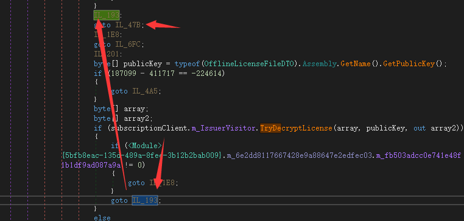
    
    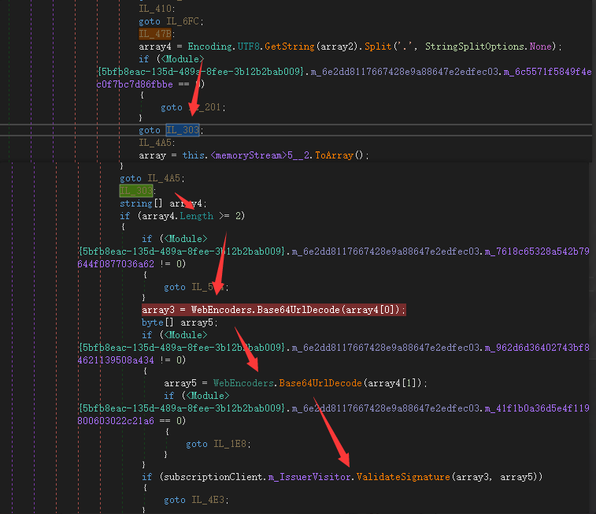

4. 查看 `ValidateSignature` 内部；

    根据方法参数可知第一个是数据，第二个是签名，于是原始数据就是 `{base64_数据}.{base64_签名}`；

    emmm....验证方法是RSA，由于RSA需要公钥和私钥配合使用，估计找不到私钥，直接返回true吧。
    
    

    把 `0X11 0X01` 改为 `0x17 0x00`

5. 改好后，断点跟着走，出现JSON解析的代码；所以数据就是JSON格式的，而对应格式是 `OfflineLicenseFileDTO`，将其复现。值得留意的是里面有个 `AdditionalData` 字段，这里面的数据不好确定。
    
    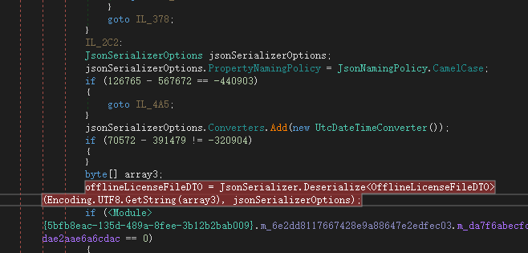

    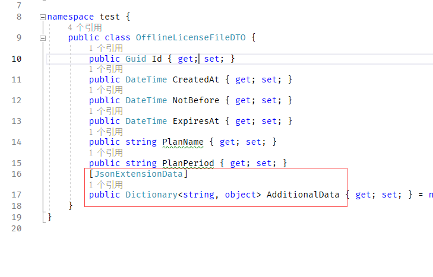

## 4 AdditionalData中的数据 （很关键）

这部分有些许麻烦，所以单独拎出来。

1. 在 `ValidateOfflineLicense` 最后有个 `setResult` 将license的内容保存了；当我要断点下一步的时候，跳到 `SetupModel` 但参数是null，就很怪，再进去看看，null是不对的；因此，应该是调试的问题导致部分逻辑被跳过了。

    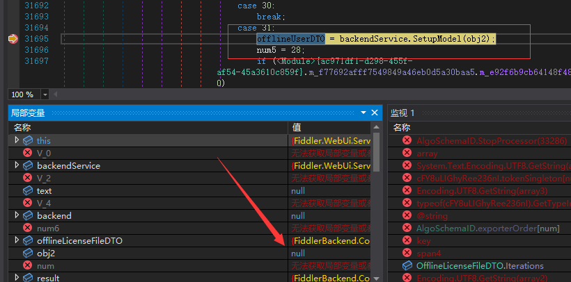
2. 寻找obj2的源头，定位到一个 `AdditionalData` 取值，但是断点断不住；

    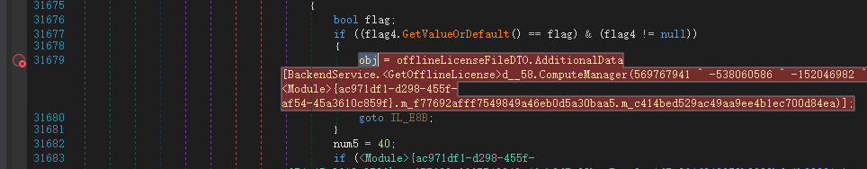

    再往上找flag4，有能断点的先断上。

    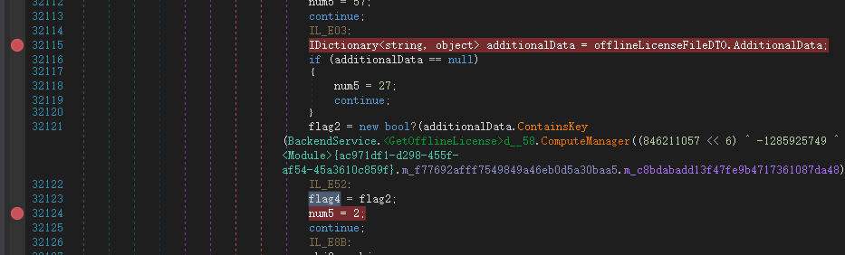
3. 再跑一下，停住了；接下来去断 `ContainsKey` 里面的；

    
    OK，拿到了是 users

    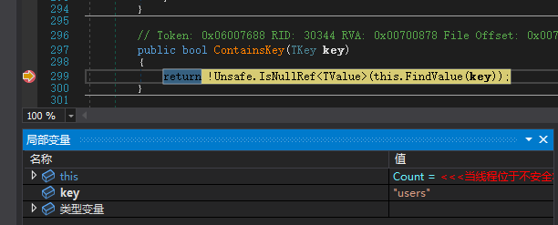
4. 结合 `SetupModel` 里面的逻辑，AdditionalData的结构至少应该是这样的：
    
    ```json
    {
      "users": [
        {
          "description": "OfflineUserDTO结构的数据"
        }
      ]
    }
    ```
5. 替换数据重跑，有数据了

    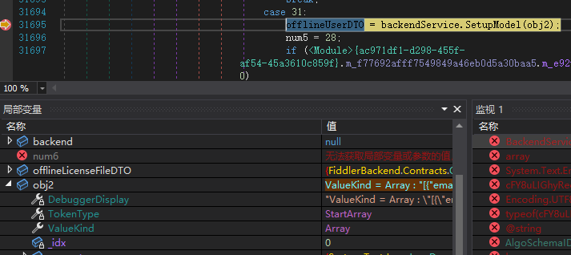

## 5 让许可证生效

在SetupModel中有一个调用 `BackendService.VisitProducer().EmailAddress`，在调试后发现它总是空的。

查看 `VisitProducer` 实现后得知，这个实际上等同于：`UserPrincipal.Current.EmailAddress`;

而 `UserPrincipal` 是在 `System.DirectoryServices.AccountManagement` 中的，这是域相关的服务；

也就是说，默认情况下普通个人电脑是无法通过这个取到邮件地址，需要具有ActiveDirectory功能。

这是我在虚拟机下测试的结果：

  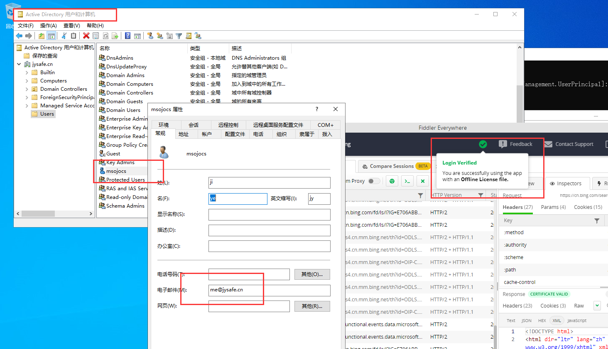